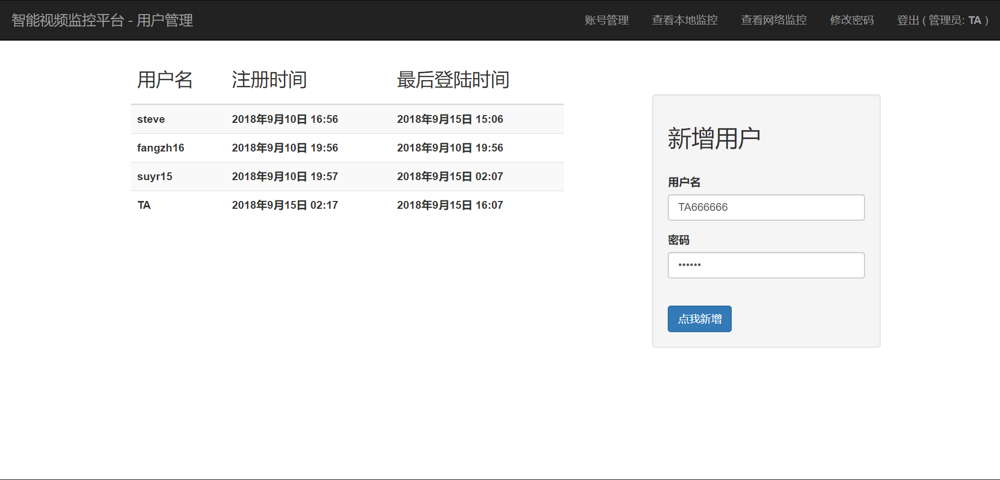

# 智能视频监控平台

## 小组成员

软61班 苏宇荣 2015080045

软62班 房泽华 2016012072


## 环境配置

| 项目       | 详情       |
| :--------- | ---------- |
| 操作系统   | Windows 10 |
| Python版本 | 3.6        |
| Django版本 | 2.1        |
| 数据库     | SQLite3    |


| 第三方依赖 | 协议       | 作用                                |
| ---------- | ---------- | ----------------------------------- |
| OpenCV     | BSD        | 打开本地/RTSP协议摄像头，获取视频帧 |
| TensorFlow | Apache 2.0 | 处理视频帧，进行实时物体识别        |
| Matplotlib | PSF        | 绘图                                |


## 启动

### 1. 一键启动方法

如果Windows系统中已经安装好Python 3.6，并配置好了环境变量，且变量名Python，那么可双击 runserver.bat 一键启动所有必要脚本。


### 2.  手动启动

在上述1.方法无效的情况下，则需要 cmd 到 runserver.bat 同级目录，执行下列语句：

```
cd utils\image_remover
python image_remover.py
cd ..
cd record_analyzer
python record_analyzer.py
cd ..
cd ..
python intelligent_monitoring_platform/manage.py runserver
```

默认情况下，等待数秒后，浏览器打开  http://127.0.0.1:8000/imp/login 即可访问登陆界面。


## 功能描述与实现详情

### 1. 登陆

浏览器打开  http://127.0.0.1:8000/imp/login 即可访问登陆界面。

登陆与认证的实现使用django.contrib模块。

如果用户上次登陆时未有退出而且上次登陆时间距离访问此页面时刻不足30分钟，则自动登陆进入本地监控页面。

未登录用户看到界面如下。


用户登陆后，如果用户更换浏览器，则需要重新登陆。


### 2. 首页

#### 2.1  界面布局

用户登陆成功后，看到的默认界面类似如下。


界面分为导航栏、视频监控模块、消息模块。系统根据登陆用户是否为管理员作出有区分的界面渲染。

管理员界面/普通用户界面的主要区别在于导航栏是否有账号管理模块：


#### 2.2 视频监控模块

我们的视频监控使用的是流媒体技术向前端推送视频流，用到了Django的StreamingHttpResponse。同时，我们的视频监控支持调用服务端本地的摄像头与RTSP协议的网络摄像头。

我们使用TensorFlow Object Detection API的*ssd_mobilenet_v1*模型对视频帧进行了处理，使其能够识别各类物体，并把每一帧置信度大于 > 50% 的被侦测物体信息在数据库中进行了持久化记录。如果视频中出现了人，则在视频监控标题右侧显示红色警告“有人闯入”，如果视频内没有侦测到人则在同一地方显示一切正常。  


#### 2.3 消息模块

当视频产生如下事件：

一切正常 -> 有人闯入 -> 一切正常 

且最后一个一切正常的时间保持5秒以上，系统会自动生成一条“检测到人”的报警记录，此纪录会被储存到数据库中。前端通过轮询的方式，向后台获取消息，自动更新消息模块。最新生成的消息会在模块的顶部出现。


### 3. 修改密码

不论是普通用户还是管理员用户，都可以通过导航栏进入修改密码的界面。


前端会对密码是否为空、两次输入密码是否一致进行检验，并给出实时的提示（动画效果）。

密码更换通过 Django 用户系统提供的 `set_password` 函数实现。


### 4. 管理员功能

如果登陆账号为管理员账号，那么在导航栏中会比普通的用户多出 “账号管理” 一栏。



进入账号管理界面，可以看到所有用户的最后注册 / 最后登陆时间。管理员可以通过右边新增用户栏增加普通账户。


### 5. 登出

点击导航栏最后一项即可登出系统。界面自动跳转到登陆界面。功能使用Django内置模块实现。


## 实现功能点汇总

- ### 网站服务环境要求

  - [x] 在Windows/Linux系统上可以稳定运行至少二十分钟，内存占用量长期看来基本稳定

  - [x] 提供部署方式的说明文档

  - [x] 提供项目中直接用到的第三方库的名称、开发方、授权协议和功能解释的文档 

- ### 网站显示摄像头画面

  - 网站服务搭建

  - 网站访问鉴权

    - [x] 支持多用户，用户可以修改密码
    - [x] 管理员用户可以添加普通用户
    - [x] 对操作进行用户登录状态和权限的校验（Django API）

  - 使用python读取摄像头画面

    - [x] 支持RTSP协议的网络摄像头

  - 网页端显示监控画面

    - [x] 使用流媒体技术向前端推送视频流

- ### 使用人工智能技术分析监控视频

  - 使用深度学习算法对视频帧做分析

    - [x] 对物体分类及定位进行分析
    - [x] 分析过程在新线程中执行
    - [x] 对单帧图像的分析在5秒钟以内完成

  - 分析任务

    - [x] 识别画面中的物体的大致类别

    - [x] 检测画面中的物体的位置

- ### 提供监控报警功能

  - [x] 有人进入摄像头画面中，则生成一条警示记录显示到监控网页上

  - [x] 用户可以查看历史警示记录，可以删除选定的记录使其不再显示


## 测试用户

### 管理员

* 账号：TA
* 密码：233333

### 普通用户

* 账号：suyr15
* 密码：suyr15


## 参考

1. TensorFlow Object Detection API https://github.com/tensorflow/models/tree/master/research/object_detection

